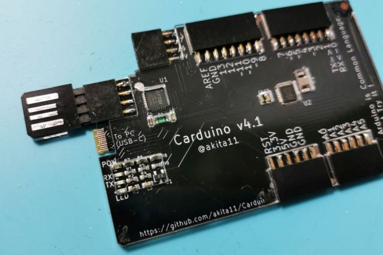

# Carduino

Carduino (v4.1)は、クレジットカードサイズ・厚さ2.4mmの、ArduinoUNO互換機です。
財布などにいつもいれておいて、いつでもその場でArduinoを使うことができます。
「Arduinoは興味あるんだけど、まだ触ったことないんだよね」という人に会ったら、その場でArduinoを体験してもらいましょう。
* ArduinoIDEの導入からLチカまでの手順は、本体裏面にシルクで書かれています。またArduinoIDEのダウンロード先もQRコードで読み取れます。
* USB-Aコネクタ（収納式）で、PCのUSB端子に直接差し込むことができます。またUSB Type-Cケーブルで接続することもできます。
* Arduinoの入出力端子はメスソケットですので、ジャンパワイヤ等をさしてつかうこともできます。
* USB-シリアル変換には、FTDI FT232Rを使っています。
* [スイッチサイエンスで委託販売はじまりました](https://www.switch-science.com/catalog/6368/)

# 使い方

本体裏面のシルクを参照してください。

PCとの接続は、以下の2通りが可能です。
* 本体のコネクタをいったんはずし、以下のようにとりつけ、PCのUSBポートに直接さしこみます。（※コネクタの向きに注意してください。収納時とは表裏を逆にさして使用します。表裏を逆で使用すると、本体やPCを破損する恐れがあります）

* USB Type-Cケーブルを本体コネクタ部にさしこみます。

なお未使用時にUSBコネクタ部を格納しておくコネクタには、A6/A7、電源5V、GNDがつながっています。

# 作り方

* ガーバーデータ(Carduino_v41_gerber.zip)で基板製造（板厚0.6mm）し、部品表（Carduino_v41_bom.xlsx）の部品をとりつけます。
* 4p、6p、8pのピンソケット（各2個：秋月電子等で購入できます）を、基板の溝にあわせて横向けにはんだ付けします。また4pピンヘッダ（秋月電子等で購入できます）をUSBコネクタ側にとりつけます。
* 板厚1mmまたは1.5mmのアクリル板をCarduino_v41_cover.pdfでレーザーカッター等でカットし、本体に透明両面テープや透明ボンド等で固定します。
* ArduinoUNO用のブートローダを書き込みます

# 作者

Junichi Akita (akita@ifdl.jp, @akita11)

